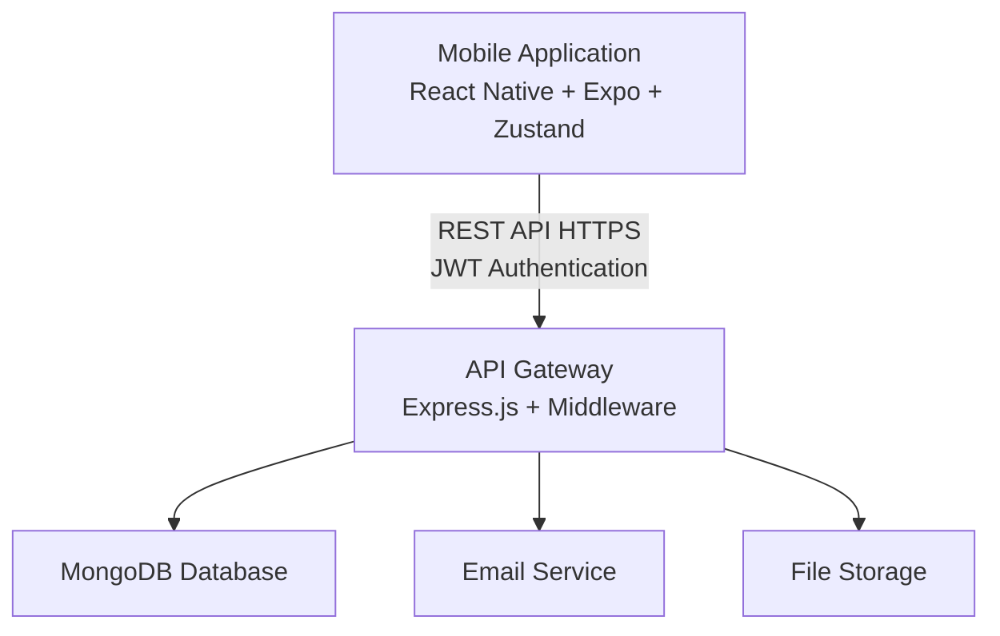
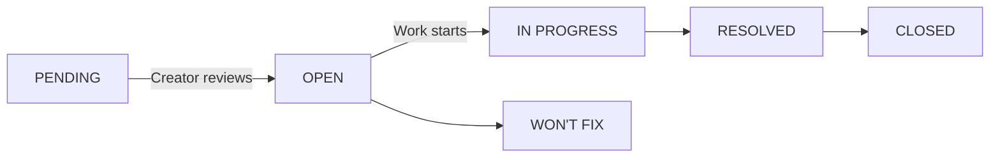

# Betalift Project
**Collaborative Beta Testing Platform**

---

## Table of Contents

1. [MVP Overview](#1-mvp-overview)
2. [Architecture & Stack](#2-architecture--stack)
3. [Mobile Application](#3-mobile-application)
4. [Server (Backend API)](#4-server-backend-api)
5. [Workers & Background Jobs](#5-workers--background-jobs)
6. [Testing Strategy](#6-testing-strategy)
7. [App Assets & Design](#7-app-assets--design)
8. [Documentation Standards](#8-documentation-standards)
9. [Project Release Management](#9-project-release-management)
10. [Contributions & Engagement](#10-contributions--engagement)

---

## 1. MVP Overview

### Vision Statement

Betalift is a collaborative platform designed to bridge the gap between software creators and early adopters. It enables developers to share their beta projects with a community of testers, gather valuable feedback, and identify bugs before official releases.

### Core Value Proposition

#### For Creators
Get your beta projects in front of real users who can provide actionable feedback, helping you identify bugs, UX issues, and feature gaps before your main release.

#### For Testers
Discover exciting new projects early, contribute to their development, and build a reputation as a valuable beta tester in the community.

### MVP Feature Set

| Feature | Description |
|---------|-------------|
| **Project Posting** | Creators can post beta projects with descriptions, screenshots, links (TestFlight, Play Store, etc.) |
| **Tester Recruitment** | Projects can attract testers through public listings or invite-only access |
| **Feedback System** | Structured feedback collection with categories: bugs, features, improvements, praise |
| **Communication** | Direct messaging between creators and testers |
| **Notifications** | Real-time updates on project activity, feedback, and messages |

---

## 2. Architecture & Stack

### System Overview

Betalift follows a modern full-stack architecture with a React Native mobile application communicating with a Node.js/Express REST API backend.



### Core Technologies

| Layer | Technology | Purpose |
|-------|------------|---------|
| **Mobile Framework** | React Native (Expo) | Cross-platform mobile app |
| **Language** | TypeScript | Type-safe development |
| **Animations** | React Native Reanimated | Smooth, performant animations |
| **State Management** | Zustand | Lightweight, scalable state |
| **Backend Framework** | Express.js | RESTful API server |
| **Runtime** | Node.js | JavaScript server runtime |
| **Database** | MongoDB (Mongoose) | Document-based data storage |
| **Authentication** | JWT (JSON Web Token) | Stateless auth with refresh |
| **File Uploads** | Multer | Multipart form data handling |
| **Email** | Nodemailer | Transactional emails |
| **Logging** | Winston | Structured application logs |


## 3. Mobile Application

### Overview

The mobile application is built with React Native and Expo, providing a seamless cross-platform experience for iOS and Android users. The app uses file-based routing via Expo Router and Zustand for state management.


### 3.1 Landing Page

#### Purpose
The landing page serves as the first impression for new users, showcasing Betalift's value proposition through engaging animations and clear messaging.

#### Features

| Component | Description |
|-----------|-------------|
| **Hero Section** | Animated value proposition with eye-catching visuals and headline text |
| **How It Works** | 3-step process explaining the platform:<br/>1. Create/Post your beta project<br/>2. Connect with testers<br/>3. Collect feedback & iterate |
| **Benefits Section** | Highlights advantages for both creators and testers with icon-based callouts |
| **CTA Buttons** | Primary: "Get Started" → Register<br/>Secondary: "Learn More" → Scroll to details |
| **Animations** | Smooth scroll animations, parallax effects, fade-in elements using Reanimated |

#### Animation Guidelines

- Use Reanimated for 60fps animations
- Implement scroll-triggered animations for progressive reveal
- Keep animations subtle and purposeful (300-500ms duration)
- Support reduced motion preferences

### 3.2 Authentication Pages

#### Purpose
Secure user authentication with seamless onboarding experience for new users.

#### Login Screen

| Element | Specification |
|---------|--------------|
| **Email Input** | Required, validated email format |
| **Password Input** | Required, secure text entry |
| **Remember Me** | Optional toggle for persistent session |
| **Forgot Password** | Link to password reset flow |
| **Social Auth** | Google, Apple sign-in integration (optional) |
| **Register Link** | "Don't have an account? Sign up" |
| **Error Handling** | Inline validation and server error display |

#### Register Screen

| Element | Specification |
|---------|--------------|
| **User Type Selection** | Creator / Tester / Both |
| **Username** | Required, 3-30 characters, unique |
| **Email** | Required, valid email, unique |
| **Password** | Required, min 8 chars, strength indicator |
| **Confirm Password** | Must match password field |
| **Terms Acceptance** | Required checkbox with link to terms |
| **Profile Setup** | Optional: avatar, bio, display name |
| **Login Link** | "Already have an account? Sign in" |

#### Authentication Flow

1. User submits credentials
2. Server validates and returns JWT access + refresh tokens
3. Tokens stored securely in device storage (AsyncStorage)
4. Access token attached to all authenticated API requests
5. Refresh token used to obtain new access tokens when expired

### 3.3 Home Screen (Dashboard)

#### Purpose
Central hub displaying user's project activity, both as a creator and tester.

#### My Projects (Creator View)

- Lists all projects created by the authenticated user
- **Status indicators** with color coding:
  - 🟢 **Active** - Currently accepting testers
  - 🔵 **Beta** - In beta testing phase
  - 🟡 **Paused** - Temporarily not accepting new testers
  - ⚫ **Closed** - No longer accepting feedback
- **Quick stats:** tester count, feedback count, rating
- **Quick actions:** Edit, View Feedback, Manage Members

#### Joined Projects (Tester View)

- Lists all projects the user has joined as a tester
- Shows pending invites and join requests
- Recent activity feed (new feedback, responses, releases)
- **Quick action:** Submit Feedback

#### Features

- ✅ Pull to refresh for latest data
- 🔍 Search bar for filtering projects
- 🎯 Filter by status, category, or activity
- 📑 Tab navigation between creator and tester views
- 📭 Empty state with CTA to create or explore projects

### 3.4 Project Detail Screen

#### Purpose
Comprehensive view of a project's information, enabling users to understand the project and take action (join, provide feedback, or manage).

#### Information Displayed

| Section | Details |
|---------|---------|
| **Header** | Project icon, name, short description |
| **Status Badge** | Current status (active, beta, closed, paused) |
| **Creator Info** | Avatar, username, link to profile |
| **Full Description** | Detailed project description (up to 5000 chars) |
| **Screenshots** | Swipeable gallery (full-screen view on tap) |
| **Links** | Website, TestFlight, Play Store, App Store, GitHub, Discord, Documentation |
| **Tech Stack** | Tags showing technologies used |
| **Statistics** | Testers, feedback count, rating, category |
| **Releases** | Latest release info with version number |

#### Available Actions

| User Role | Available Actions |
|-----------|-------------------|
| **Not Joined** | • Request to Join / Join (if public)<br/>• Share Project |
| **Tester** | • View All Feedback<br/>• Submit New Feedback<br/>• View Releases<br/>• Leave Project |
| **Creator (Owner)** | • Edit Project<br/>• Manage Members<br/>• Review Join Requests<br/>• Create Release<br/>• View Analytics<br/>• Close/Pause Project |

### 3.5 Feedback Screen (Core Feature)

#### Purpose
The feedback system is the core functionality of Betalift, enabling testers to report issues, suggest features, and help creators improve their projects.

#### Feedback Types & Categories

| Type | Icon | Description |
|------|------|-------------|
| **Bug** | 🐛 | Something isn't working correctly |
| **Feature** | ✨ | New functionality request |
| **Improvement** | 💡 | Enhancement to existing features |
| **Praise** | 🎉 | Positive feedback about the project |
| **Question** | ❓ | General questions about the project |
| **Other** | 📝 | Miscellaneous feedback |

#### Priority Levels

| Priority | Color | Use Case |
|----------|-------|----------|
| **Critical** | 🔴 Red | App crash, data loss, security issue |
| **High** | 🟠 Orange | Major feature broken, blocking issue |
| **Medium** | 🟡 Yellow | Minor bug, inconvenience |
| **Low** | 🟢 Green | Cosmetic issue, nice-to-have |

#### Feedback Status Workflow



#### Feedback Detail View

- ✅ Full feedback description with markdown support
- 📷 Screenshots/attachments (swipeable gallery)
- 📱 Device information (auto-captured):
  - Platform (iOS/Android/Web)
  - Device model
  - OS version
  - App version
  - Screen size
- 📝 Steps to reproduce (for bugs)
- 💬 Comments thread with reply functionality
- 👍👎 Voting system (upvote/downvote)
- 🏷️ Status updates with timestamps

#### Create Feedback Form

| Field | Specification |
|-------|--------------|
| **Type** | Required - Select from categories |
| **Priority** | Optional - Default: Medium |
| **Title** | Required - Max 200 characters |
| **Description** | Required - Rich text, max 5000 characters |
| **Screenshots** | Optional - Up to 5 images, max 10MB each |
| **Steps to Reproduce** | Optional - For bug reports |
| **Device Info** | Auto-captured - User can edit/hide |

### 3.6 Profile Screen

#### Purpose
User profile management, statistics display, and application settings.


#### Settings Categories

| Category | Options |
|----------|---------|
| **Account Settings** | • Change password<br/>• Email verification<br/>• Delete account |
| **Notifications** | • Push notifications (on/off)<br/>• Email notifications (on/off)<br/>• Feedback updates<br/>• Project invites<br/>• Weekly digest |
| **Privacy** | • Profile visibility (public/private)<br/>• Show email to project members<br/>• Show statistics |
| **Appearance** | • Theme: Light / Dark / System<br/>• Language selection |
| **About & Support** | • App version<br/>• Terms of Service<br/>• Privacy Policy<br/>• Help & FAQ<br/>• Contact Support |
| **Session** | • Logout |

---

## 4. Server (Backend API)

### Overview

The server is a RESTful API built with Express.js and Node.js, using MongoDB as the database. It handles authentication, data persistence, and business logic for the Betalift platform.


### Data Models

| Model | Key Fields |
|-------|------------|
| **User** | email, password (hashed), username, displayName, avatar, bio, role, stats, settings |
| **Project** | name, description, ownerId, status, category, links, screenshots, techStack, testerCount |
| **Feedback** | projectId, userId, type, priority, title, description, screenshots, deviceInfo, status |
| **FeedbackComment** | feedbackId, userId, content, parentId |
| **FeedbackVote** | feedbackId, userId, type (up/down) |
| **Conversation** | participants, lastMessage, unreadCount |
| **Message** | conversationId, senderId, content, readAt |
| **Notification** | userId, type, title, message, relatedEntity |
| **JoinRequest** | projectId, userId, status, message |
| **ProjectMembership** | projectId, userId, role, joinedAt |
| **Release** | projectId, version, title, changelog, type, status, downloadUrl, publishedAt |

### Error Handling

Custom error classes for consistent API responses:

- `ApiError` (base class)
- `BadRequestError` (400) - Invalid input
- `UnauthorizedError` (401) - Authentication required
- `ForbiddenError` (403) - Access denied
- `NotFoundError` (404) - Resource not found
- `ConflictError` (409) - Duplicate resource
- `ValidationError` (422) - Validation failure

### Response Format

**Success:**
```json
{
  "success": true,
  "data": { ... },
  "message": "Operation completed successfully"
}
```

**Error:**
```json
{
  "success": false,
  "error": "Error message",
  "details": [ ... ]
}
```

---

## 5. Workers & Background Jobs

### Overview

Background jobs handle asynchronous tasks that don't need to block the main request-response cycle. These improve performance and user experience.

### Planned Background Jobs

| Job | Trigger | Description |
|-----|---------|-------------|
| **Email Queue** | User actions | Send transactional emails (welcome, password reset, notifications) |
| **Weekly Digest** | Scheduled (weekly) | Compile and send weekly activity summaries |
| **Notification Cleanup** | Scheduled (daily) | Archive old notifications (older than 90 days) |
| **Analytics Aggregation** | Scheduled (hourly) | Calculate project stats, user engagement metrics |
| **Image Processing** | On upload | Resize and optimize uploaded images |
| **Inactive Project Alert** | Scheduled (weekly) | Notify creators of inactive projects |

### Implementation Considerations

- **Technology:** Consider Bull (Redis-based) or Agenda (MongoDB-based)
- **Retry Logic:** Implement exponential backoff for failed jobs
- **Monitoring:** Track job success/failure rates
- **Priority Queues:** High-priority for user-triggered, low for scheduled
- **Idempotency:** Ensure jobs can safely run multiple times

---

## 6. Testing Strategy

### Overview

A comprehensive testing strategy ensures code quality, prevents regressions, and builds confidence in the application's reliability.

### Testing Pyramid

```
        ┌───────────┐
        │    E2E    │  Few, slow, expensive
        │   Tests   │  (Detox for mobile)
        ├───────────┤
        │Integration│  Some, moderate speed
        │   Tests   │  (API endpoints, DB)
        ├───────────┤
        │   Unit    │  Many, fast, cheap
        │   Tests   │  (Functions, components)
        └───────────┘
```

### Backend Testing

| Test Type | Framework | Scope |
|-----------|-----------|-------|
| **Unit Tests** | Jest | Controllers, services, utilities |
| **Integration Tests** | Jest + Supertest | API endpoints, database operations |
| **Database Tests** | Jest + mongodb-memory-server | Model validations, queries |

### Mobile Testing

| Test Type | Framework | Scope |
|-----------|-----------|-------|
| **Unit Tests** | Jest | Stores, utilities, helpers |
| **Component Tests** | React Native Testing Library | UI components in isolation |
| **E2E Tests** | Detox | Full user flows |
| **Snapshot Tests** | Jest | UI regression detection |

### Test Coverage Goals

- ✅ **Unit Tests:** 80% coverage minimum
- ✅ **Integration Tests:** All API endpoints covered
- ✅ **E2E Tests:** Critical user flows (auth, feedback submission)

### Testing Best Practices

- Follow AAA pattern (Arrange, Act, Assert)
- Use descriptive test names: "should return 401 when token is invalid"
- Mock external dependencies (email, file storage)
- Use separate test database (`MONGODB_URI_TEST`)
- Run tests in CI/CD pipeline before merge

---

## 7. App Assets & Design

### Overview

Consistent visual design ensures a professional, cohesive user experience across all screens and platforms.

### Design System Components

| Component | Location | Description |
|-----------|----------|-------------|
| **Theme Configuration** | `constants/theme.ts` | Colors, spacing, typography |
| **Button** | `components/ui/button.tsx` | Primary, secondary, outline, ghost |
| **Input** | `components/ui/input.tsx` | Text input with validation states |
| **Card** | `components/ui/card.tsx` | Container component |
| **Avatar** | `components/ui/avatar.tsx` | User profile images |
| **Badge** | `components/ui/badge.tsx` | Status indicators |
| **Collapsible** | `components/ui/collapsible.tsx` | Expandable sections |

### Color Palette

| Color Name | Light Mode | Dark Mode | Usage |
|------------|------------|-----------|--------|
| **Primary** | #007AFF | #0A84FF | Actions, links |
| **Secondary** | #5856D6 | #5E5CE6 | Secondary actions |
| **Success** | #34C759 | #30D158 | Positive states |
| **Warning** | #FF9500 | #FF9F0A | Caution states |
| **Error** | #FF3B30 | #FF453A | Error states |
| **Background** | #FFFFFF | #000000 | Main background |
| **Surface** | #F2F2F7 | #1C1C1E | Card backgrounds |
| **Text Primary** | #000000 | #FFFFFF | Main text |
| **Text Secondary** | #8E8E93 | #8E8E93 | Muted text |

### Typography

| Style | Size | Weight | Usage |
|-------|------|--------|-------|
| **Heading 1** | 32px | Bold | Page titles |
| **Heading 2** | 24px | Bold | Section titles |
| **Heading 3** | 20px | Semibold | Card titles |
| **Body** | 16px | Regular | Main content |
| **Body Small** | 14px | Regular | Secondary content |
| **Caption** | 12px | Regular | Timestamps, hints |

### Icon Library

- **Primary:** @expo/vector-icons (Feather, MaterialCommunityIcons)
- **Consistent icon sizes:** 16px (small), 24px (default), 32px (large)
- **Use outlined icons** for inactive states, filled for active

### App Icon & Splash Screen

- **Location:** `apps/mobile/assets/images/`
- **App Icon:** 1024x1024px PNG (will be resized by Expo)
- **Splash Screen:** Full-screen branding during app load
- **Adaptive Icon:** Separate foreground/background for Android

### Image Guidelines

- **Screenshots:** Max 10MB per image
- **User Avatars:** 256x256px recommended
- **Project Icons:** 512x512px recommended
- **Supported Formats:** JPEG, PNG, WebP

---

## 8. Documentation Standards

### Overview

Comprehensive documentation ensures maintainability, onboarding efficiency, and knowledge sharing among team members and contributors.

### Code Documentation Standards

**TypeScript/JavaScript:**
- Use JSDoc comments for functions and classes
- Document parameters, return types, and examples
- Add inline comments for complex logic


### API Documentation

- Document all endpoints with:
  - HTTP method and path
  - Request headers (authentication)
  - Request body schema
  - Response schema (success and error)
  - Example requests/responses
- Use Postman collection (`apps/server/postman/`) for testing
- Keep documentation in sync with code changes

### Changelog Management

- Maintain `CHANGELOG.md` in root directory
- Follow [Keep a Changelog](https://keepachangelog.com/) format
- **Categories:** Added, Changed, Deprecated, Removed, Fixed, Security
- **Version numbering:** Semantic Versioning (MAJOR.MINOR.PATCH)

---

## 9. Project Release Management

### Overview

Structured release management ensures smooth deployments, clear versioning, and effective communication of changes to users and stakeholders.

### Version Strategy

**Semantic Versioning (SemVer):** `MAJOR.MINOR.PATCH`

- **MAJOR:** Breaking changes (incompatible API changes)
- **MINOR:** New features (backwards-compatible)
- **PATCH:** Bug fixes (backwards-compatible)

**Pre-release tags:** `1.0.0-alpha.1`, `1.0.0-beta.1`, `1.0.0-rc.1`

### Release Types

| Type | Description | Audience |
|------|-------------|----------|
| **Alpha** | Early development build | Internal team only |
| **Beta** | Feature-complete, testing | Selected testers |
| **Release Candidate** | Final testing before GA | Expanded testers |
| **General Availability** | Production release | All users |

### Release Checklist

#### Pre-Release
- [ ] All tests passing (unit, integration, E2E)
- [ ] Code review completed
- [ ] Changelog updated
- [ ] Version numbers bumped (`package.json`, `app.json`)
- [ ] Documentation updated
- [ ] Security audit (no critical vulnerabilities)

#### Mobile Release
- [ ] Build iOS version (`eas build --platform ios`)
- [ ] Build Android version (`eas build --platform android`)
- [ ] Test on physical devices
- [ ] Submit to TestFlight (iOS)
- [ ] Submit to Play Store Beta (Android)
- [ ] Create release notes

#### Server Release
- [ ] Database migrations applied (if any)
- [ ] Environment variables updated
- [ ] Deploy to staging environment
- [ ] Smoke tests on staging
- [ ] Deploy to production
- [ ] Monitor logs for errors

#### Post-Release
- [ ] Tag release in Git (`v1.0.0`)
- [ ] Create GitHub release with notes
- [ ] Announce to users (in-app notification, email)
- [ ] Monitor error tracking and analytics

### Deployment Environments

| Environment | Purpose | Access |
|-------------|---------|--------|
| **Development** | Local development | Developers |
| **Staging** | Pre-production testing | Team + QA |
| **Production** | Live application | All users |

---

## 10. Contributions & Engagement

### Overview

Building an active community of contributors is essential for the long-term success and sustainability of Betalift.

### How to Contribute

#### 1. Fork the Repository
Create your own copy of the codebase
```bash
git clone https://github.com/YOUR_USERNAME/betalift.git
```

#### 2. Set Up Development Environment
- Follow setup instructions in `README.md`
- Install dependencies for both mobile and server
- Configure environment variables

#### 3. Create a Feature Branch
```bash
# Branch naming: feature/add-dark-mode, fix/login-bug
git checkout -b feature/your-feature-name
```

#### 4. Make Changes
- Follow code style guidelines (ESLint + Prettier)
- Write tests for new functionality
- Update documentation as needed

#### 5. Submit Pull Request
- Create PR to `dev` branch (or `main` for hotfixes)
- Fill out PR template completely
- Reference related issues (`Closes #123`)
- Wait for code review

### Code Style Guidelines

- **TypeScript:** Strict mode enabled, explicit types preferred
- **Formatting:** Prettier with project configuration
- **Linting:** ESLint with React Native/Node.js rules
- **Naming:** camelCase for variables/functions, PascalCase for components/classes
- **Comments:** Explain "why", not "what"

### Branch Strategy

```
main (production-ready)
  │
  └── dev (development integration)
        │
        ├── feature/user-auth
        ├── feature/feedback-system
        └── fix/login-validation
```

### Issue Guidelines

**Bug Reports:**
- ✅ Clear, descriptive title
- ✅ Steps to reproduce
- ✅ Expected vs actual behavior
- ✅ Environment details (device, OS, app version)
- ✅ Screenshots/videos if applicable

**Feature Requests:**
- ✅ Problem statement (what need does this address?)
- ✅ Proposed solution
- ✅ Alternative solutions considered
- ✅ Additional context

### Community Engagement

- **GitHub Discussions:** General questions and ideas
- **Issues:** Bug reports and feature requests
- **Pull Requests:** Code contributions
- **Discord** _(planned)_: Real-time community chat

### Recognition

Contributors are recognized through:
- Contributors list in README
- Acknowledgment in release notes
- Contributor badges _(planned)_

### Contact

- **GitHub:** [https://github.com/nyambogahezron/betalift](https://github.com/nyambogahezron/betalift)
- **Issues:** [https://github.com/nyambogahezron/betalift/issues](https://github.com/nyambogahezron/betalift/issues)
- **Email:** _(To be added)_

---

## Document Information

- **Document Version:** 1.0.0
- **Last Updated:** January 3, 2026
- **Maintained by:** Betalift Team
- **Status:** Complete

---

**© 2026 Betalift. All rights reserved.**
